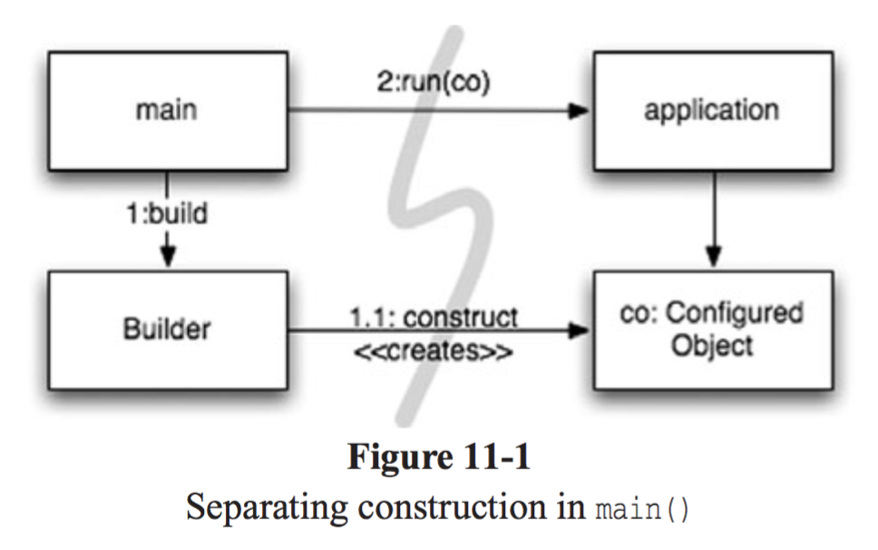
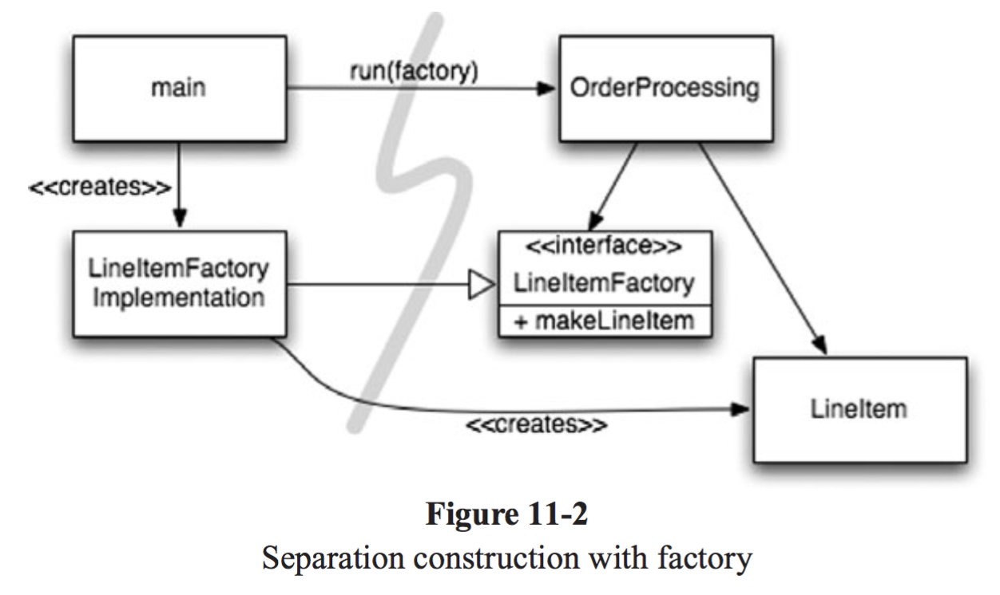
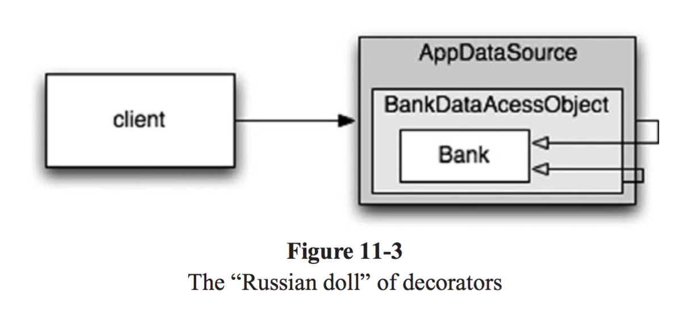

# 11장 시스템

어떻게 하면 견고한 시스템을 만들 수 있을까? 🚧 

## 구성

1. [도시를 세운다면?](#도시를-세운다면?)
2. [시스템 제작과 시스템 사용을 분리하라](#시스템-제작과-시스템-사용을-분리하라)
3. [확장](#확장)
4. [결론](#결론)


## 도시를 세운다면?

여러분이 도시 :classical_building: 를 세운다면?  

온갖 세세한 사항을 혼자서 관리할 수 있을까요?  

> 그건 나도 무리 😰 ..ㅎㅎ  

도시에는 각각의 관리 팀들이 존재하기 때문이다  

> 수도 관리 팀, 전력 관리 팀, 교통 관리 팀, ... etc. 

도시가 잘 돌아가는 이유는 적절한 `추상화` 와 `모듈화` 가 잘되어 있기 때문이에요.!  

소프트웨어도 마찬가지 입니다  

깨끗한 코드를 구현하면 **낮은 추상화 수준에서 관심사를 분리하기 쉬워집니다!**  

그래서 이번장에서는 시스템 수준에서 깨끗함을 유지하는 방법을 알아볼 예정입니다 ㅎㅎ  

<br>

준비되셨나요?

## 시스템 제작과 시스템 사용을 분리하라

무슨 말인지 잘 모르겠네요.. ㅎㅎ  

코드로 이야기하면 다음과 같아요  

```text
소프트웨어 시스템은 (애플리케이션 객체를 제작하고, 의존성을 서로 연결하는) 준비 과정과
(준비 과정 이후에 이어지는) 런타임 로직을 분리해야 한다.
```

이 단계를 시작하기 위해서는 항상 `관심사` 분리를 통해서 설계해야 된다는 말과 똑같아요!  

불행히도 아래 코드는 분리하지 않은 경우인데요..  

```java
public Service getService() {
  if (service == null) {
    service = new MyServiceImpl(...);
  }
  return service;
}
```

일명 `Lazy loading` 기법중에 하나인데요, 문제가 많습니다 정말  

1. getService 메서드가 **MyServiceImpl의 생성자에 의존**하고 있습니다 ( 이것이 해결이 안되면 컴파일이 안되죠 )
2. **테스트가 힘듭니다** = getService를 호출하기 전에 항상 테스트 전용 객체(Mock) 을 service 필드에 할당해야 된다는 것이죠
3. **MyServiceImpl 객체가 모든 상황에 적합** 한지는 알 수 없습니다

이러한 모듈성을 지키기 위해서, **일반 실행 논리와 설정 논리는 분리** 해야 할 필요가 있습니다!  

그래서 `Spring` :four_leaf_clover: 이 오랫동안 사랑받는 이유죠.   

**객체(Bean)에 대한 설정 논리를 분리** 할 수 있는 메커니즘이기 때문입니다  

### Main 분리

실제로 시스템 생성과 시스템 사용을 분리하는 한 가지 방법으로는,  

생성과 관련한 코드는 모두 `main` 이나 `main` 이 호출하는 모듈로 옮기는 방법이 있어요   

그러면 Application 입장에서는 그저 객체를 사용할 뿐이죠. 

<div>
  
</div>


즉 다시 말하자면, `Application` 입장에서는 **객체가 생성되는 과정을 모르게 되는거죠** 

물론, 객체가 생성되는 시점을 Application이 결정할 필요도 있습니다. 

이럴때는 `Abstract Factory` :factory: 패턴을 사용해서 구현하면 됩니다. 

> Abstract Factory: 서로 관련이 있는 객체를 묶어서 하나의 팩토리 클래스를 만들고, 조건에 따라 객체를 생성하는 패턴. 
>
> [참고링크](https://huisam.tistory.com/entry/AbstractFactory)

<div>
  
</div>


이 그림에서는 `OrderProcessing` 입장에서는 LineItem 이 어떻게 생성되는지 관심이 없습니다. 

오직 Factory 만이 실제 구현체를 알고 있는 것이죠. 

`OrderProcessing`은 그저 LineItem 객체를 생산하라는 명령과, 사용하는 명령 2가지 작업에만 관심이 있게 되는거죠!  

### 의존성 주입

그래서 이것이 바로 그 유명한 **DI(Dependency Injection)** 이에요. 

따라서 `DI`는 **IoC(Inversion Of Control) 기법을 의존성 관리**에 적용한 메커니즘인거죠.  

의존성 관리 맥락에서 객체는 의존성 자체를 인스턴스로 만드는 책임을 지지 않는 것인데요,  

객체에 대한 생성의 책임(SRP 준수)을 컨테이너에게 부여하여 제어의 역전을 실행하게 되는거에요.!

```java
MyService myService = applicationContext.getBean(MyService.class)
```

## 확장

우리는 마을 :house: 이 어떻게 돌아가는지, 우리의 시스템이 어떻게 관리되고 있는지 살펴보았는데요. 

확장하려면 어떻게 해야 할까요?  

우리는 이미 알고 있습니다. 🙋 `TDD`라는 것을요.!

```text
테스트 주도 개발(TDD), 리팩터링, (TDD와 리팩터링으로 얻어지는) 깨끗한 코드는
코드 수준에서 시스템을 조정하고 확장하기 쉽게 만들어줍니다
```

그리고.!

```text
소프트웨어 시스템은 물리적인 시스템과 다르다.
관심사를 적절히 분리해 관리한다면 소프트웨어 아키텍처는 점진적으로 발전할 수 있다
```

### 횡단 관심사

실제로 EJB(Enterprise JavaBeans)는 애플리케이션의 업무 로직을 가지고 있는 서버 애플리케이션 인데요,  

이 모델에서 나타낸 단점이, 특정 엔티티에 대해서 영속성을 유지하고, 비즈니스 로직도 유지해야 되는 엄청난 부담감으로 다가왔어요. 

그래서 이를 분리하고자 노력했던 것이 **횡단 관심사(Cross-cutting)** 이며, Spring 에서 `AOP(Aspect Oriented Programming)` 의 개념으로. 

자리가 잡혔죠

```text
AOP에서 관점(Aspect) 이라는 모듈 구성 개념은
특정 관심사를 지원하려면 시스템에서 특정 지점들이 동작하는 방식을 일관성 있게 바꿔야 한다
```

라고 명시하고 있습니다. 

그래서, AOP는 **대상 코드에 영향을 미치지 않는 상태로 동작을 변경** 하는 것이죠.!  

> [AOP의 동작 설명에 대한 게시글](https://huisam.tistory.com/entry/springAOP)

영속성을 예로 들자면, 프로그래머는 영속적으로 저장할 객체와 속성을 선언한 후에. 

영속성 책임을 영속성 프레임워크에 위임하는 것이죠!  

그럼 이제 프록시가 무엇인지 알아보도록 해요 :book:  

### 자바 프록시

*너무 어렵죠? ㅎㅎ* 

조금만 더 힘내요 ㅠㅠ Spring에 익숙하지 않다면 굉장히 어렵게 느껴질 수 있습니다. 

간단한 코드를 같이 살펴보도록 해볼게요. 

:white_check_mark: [코드 링크](https://github.com/ludwiggj/CleanCode/blob/master/src/clean/code/chapter11/BankImpl.java) 

이 개념이 너무나 중요한게 엔티티 Bean 을 만드는 것만으로도 관심사를 쉽게 분리하고, 쉽게 테스트 가능한 구조를 만들어주기 때문이에요. 

아래처럼요!  

<div>
  
</div>


`Bank` 라는 엔티티 하나를 만들었을 뿐인데,   

**DAO(Data Aceess Object)**로 Proxy화하여 DataBase에 접근하는 구조가 가능하기 때문이죠!

그래서 지금과 같은 어노테이션 기반의 Proxy (EJB3) 가 탄생되었고, 많이들 사용하고 있죠. 

```java
@Getter
@Setter
@Entity
@Table(name = "BANKS")
public class Bank implements Serializable {
  @Id @GeneratedValue(strategy = GenerationType.AUTO)
  private int id;
  
  @Embeddable
  public class Address {
    protected String streetAddr;
    protected String city;
    protected String state;
    protected String zipCode;
  }
  
  @Embedded
  private Address address;
  
  @OneToMany(fetch = FetchType.LAZY)
  private List<Account> accounts = new ArrayList<>();
  
  public void addAccount(Account account) {
    account.setBank(this);
    accounts.add(account);
  }
}
```

추가로 횡단 관심사를 지원하는 라이브러리중에서 `AspectJ` 라는 훌륭한 라이브러리가 있습니다. 

관심있으신 분들은 찾아보셔도 좋을 것 같아요 :smile:  

> 대충 Clean Code에는 어긋나는 것 같아 설명을 생략합니다 

## 결론

사실 *Clean Code를 보는 것인지, Spring을 보는 것* 인지 많이 헷갈리더라구요 (저도 ㅎㅎ). 

그래서 저자도 몇 가지 주요한 포인트들을 설명하고 챕터를 마무리하고 있습니다. 

하나씩 살펴볼까요?  

깨끗한 시스템을 만들기 위해서는

```text
1. 테스트 주도 시스템 아키텍쳐를 구축할 것
2. 의사 결정을 최적화 할 것
3. 명백한 가치가 있을 때 표준을 현명하게 사용할 것
4. 시스템은 도메인 특화 언어를 사용할 것
```

### 1. 테스트 주도 시스템 아키텍처

코드수준에서 아키텍처 관심사를 적절히 분리할 수 있다면, 진정한 테스트 주도 아키텍처 구축이 가능해집니다. 

위에서 설명한 Entity 와 영속성 에 대한 부분을 분리하면요!  

### 2. 의사 결정을 최적화하기

모듈을 나누고 관심사를 분리하면 지엽적인 관리와 결정이 가능해져요. 

그래서, 가장 적합한 사람에게 책임을 맡기는 것이 아주 중요합니다 = 관심사를 잘 분리하라. 

그리고 `때떄로 가능한 마지막 순간까지 결정을 미루는 방법이 최선` 인 경우도 있다고 하네요 ㅎㅎ. 

> 관심사를 잘 분리하면 분리할 수록 결정을 늦게 내려도 되고, 시스템에 가하는 변경사항이 적어집니다. 
>
> 결정의 복잡성도 많이 줄어들고요!!  

### 3. 명백한 가치가 있을 때 표준을 사용하기

표준을 적절히 잘 사용하면,  

1. 아이디어와 컴포넌트를 재사용하기 쉽고
2. 적절한 경험을 가진 사람을 구하기 쉬우며
3. 좋은 아이디어를 캡슐화하기 쉽고
4. 컴포넌트를 엮기 쉽게 만들어 줍니다!

### 4. 시스템은 도메인 특화 언어가 필요하다

도메인 특화 언어(DSL) 을 사용하면 고차원 정책부터 저차원 세부사항에 이르기까지. 

모든 추상화 수준과 모든 도메인을 POJO 로 표현할 수 있다고 하네요!  

### 진짜 결론

그래서 시스템 챕터에서 Clean Code 저자가 이야기하고 싶은 것은

```text
추상화 단계에서 의도는 명확하게 표현하고,
각 구현에서의 관심사를 적절하게 분리하게 되면
깨끗한 시스템을 설계할 수 있다
```

시스템을 설계하든 개별 모듈을 설계하든, **실제로 돌아가는 가장 단순한 수단을 사용해야 한다는 사실** 을. 

여러분들은 꼭 잊지 말아주셨으면 합니다.!   

정말 어려운데 수고 많으셨어요 ㅎㅎ👋 👋 👋 

